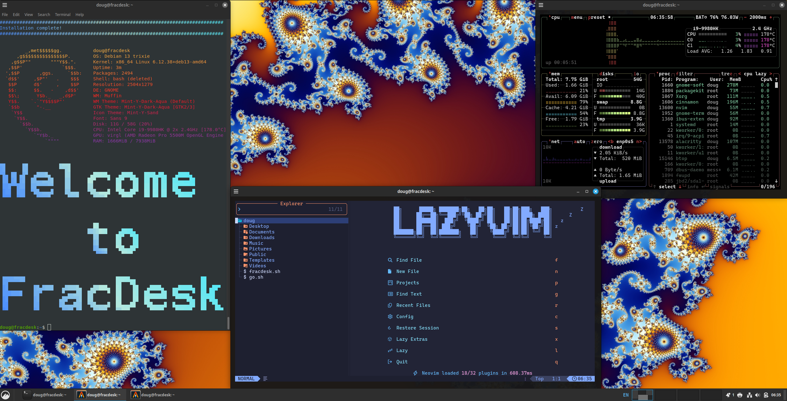

# FracDesk the Fractal Desktop

*Infinite loops spin,*  
*Branches bloom in endless dance,*  
*Nature's code unfolds.*  
  -- AI, probably



# Motivation
Every year or so, I review my technology stack to make sure I'm using the best tools for the job. Starting from first principles, I consider needs, desires, and workflows. What is the best operating system for those needs, desires, and workflows? Is it Windows, macOS, Linux, or a combination thereof? Since discovering Linux in 1997, it has been my primary desktop environment for most of those years and it continues to be the environment where I'm most productive. What about apps? What are the best of breed productivity apps that help me get my job done with a minimum amount of fuss? What is the Linux desktop environment that allows me to work with all of those applications at the same time most efficiently? Finally, which Linux distro provides that desktop environment and those apps and runs on the hardware that I need it to?

# Inspiration
Inspired by DHH and his [Omarchy](https://omarchy.org/) setup, this is my own personal recipe for my ideal desktop environment. Like a fractal, FracDesk is so simple yet so powerful. It is a curated collection of comprehensive components that balances the ideals of productivity, flexibiliity, and beauty.

# Ingredients
- Base OS: [Debian](https://www.debian.org/) 13 for stability and compatibility
- Desktop environment: [Cinnamon](https://github.com/linuxmint/Cinnamon) for a premium desktop experience
- Wallpaper: [Mandelbrot fractal](https://misterx.ca/Mandelbrot_Set/M_Set-IMAGES_&_WALLPAPER.html)
- Window themes: polished themes from [Linux Mint](https://linuxmint.com/)
- Web browser: [Chromium](https://www.chromium.org/Home/)
- Password management: [KeePassXC](https://keepassxc.org/)
- Terminal emulator: [alacritty](https://alacritty.org/) with Caskaydia Nerd Fonts
- Text editor: [neovim](https://neovim.io/) with [LazyVim](https://www.lazyvim.org/)
- Performance monitoring: [btop](https://github.com/aristocratos/btop)
- System summary: [screenfetch](https://github.com/KittyKatt/screenFetch)
- Window automation: [xdotool](https://github.com/jordansissel/xdotool)
- Eye candy: dazzling terminal effects via [tte](https://github.com/ChrisBuilds/terminaltexteffects) for demo scene nostalgia

# Why Debian?
I want to use the same base OS in a few different environments:
- bare metal and virtualized
- virtualized via Proxmox, Parallels, and other hypervisors
- when running under Parallels, I need a distro that is supported by Parallels Tools
- x86 and eventually ARM (this script has not yet been tested on ARM but it should be easy to make it work)

# Why Debian Cinnamon?
Why use Debian Cinnamon instead of Linux Mint or Linux Mint Debian Edition (LMDE)? Linux Mint and LMDE are great, but there are a few reasons why you might want to use Debian 13 Cinnamon instead:
- Linux Mint is only available for x86 architecture. If you're on ARM, you need a distro compiled for ARM that can run Cinnamon (like Debian). Please note that this script has not yet been tested on ARM but it should be easy to make it work.
- Suppose you want to take a Debian 13 derivative (like Proxmox 9) and add the Cinnamon desktop. You can then use this script to turn it into FracDesk!
- For fun and for science!
  
# Requirements
FracDesk requires the following:
- Debian 13 with Cinnamon desktop
- user account with sudo privileges
- ability to connect to Github, package repos, and other Internet sites
  
# Warning
This script is totally unsupported. If it breaks your system, you get to keep both pieces!

# Installation
1. Install Debian 13 Cinnamon. It should start off looking like this:

2. In your Debian 13 Cinnamon desktop, download and review the script (don't just blindly pipe it into bash):
```
curl -O https://raw.githubusercontent.com/dougburks/fracdesk/refs/heads/main/fracdesk.sh
```
3. Run the script:
```
bash fracdesk.sh
```
4. Enjoy your new FracDesk desktop!


# FAQ

## Is this related to Security Onion?

No, this script is not related to [Security Onion](https://github.com/Security-Onion-Solutions/securityonion) and is not supported by [Security Onion Solutions](https://securityonion.com). However, the astute reader may remember the fractal artwork from the [Onion Arcade](https://blog.securityonion.net/2016/09/onion-arcade-make-your-adversaries-cry.html).

FracDesk is intended to provide a general purpose desktop environment. Of course, you could use the included Chromium web browser to connect to your [Security Onion Console](https://docs.securityonion.net/en/2.4/soc.html)!
